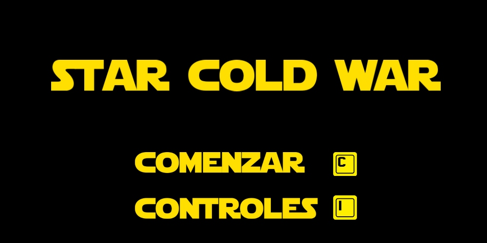
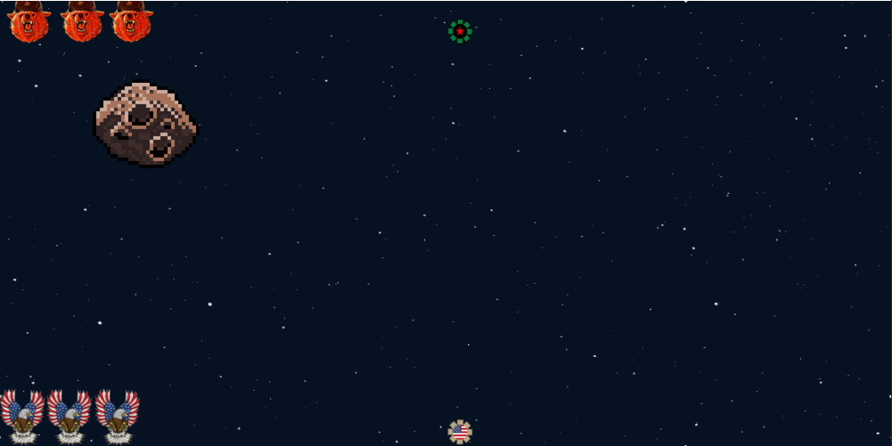
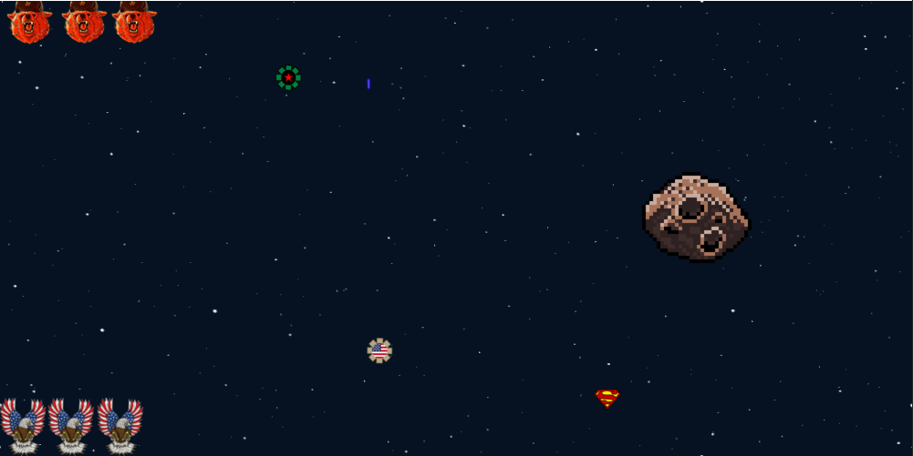
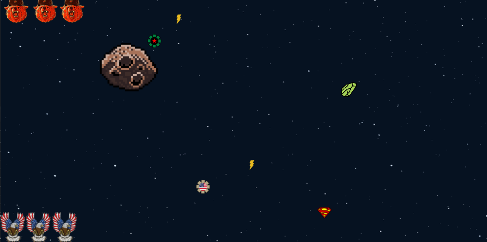
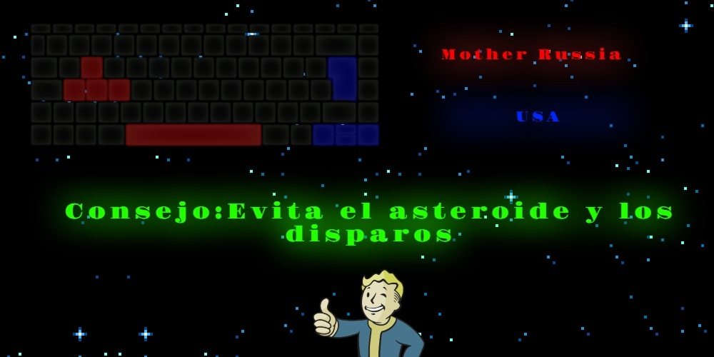

# Star Cold War

## Equipo de desarrollo :video_game:

- Noah Martin Santander Chavez :sunglasses:
- Martina Caneda :chicken:
- Luca Aiello :camel:
- Kevin Tarrisse :soccer:
- Etienne Zimmerman :bike:

## Capturas :camera:
### Pantalla de inicio

### Imagenes In-Game

## Reglas de Juego / Instrucciones :ledger:

    Aclaración: Al llegar a cualquiera de los bordes laterales, la nave aparece en el borde contrario

## Personajes :space_invader:

###  Nave Usa: 
####   Lucha por la verdad, justicia y el sueño americano
###  Nave Mother Russia:
####   Lucha por la clase obrera
###  Asteroide:
####   No lucha por nadie, solo destruye

## Power Ups :rocket:
###  Power Up Inmunidad:
####   Los proyectiles comunes no afectan a la nave
###  Power Up Anti Inmunidad:
####   Permite a los proyectiles afectar a la nave a pesar de que cuente con inmunidad
###  Power Up Disparo Mortal:
####   Independientemente de tener inmunidad, este disparo termina con la nave afectada, en caso de impactar 

    Aclaración: Todos los power ups tienen una duración de 10 segundos

## Otros

- K2004 y K2104
- Version 3.0.0
- Una vez terminado, no tenemos problemas en que el repositorio sea público 
